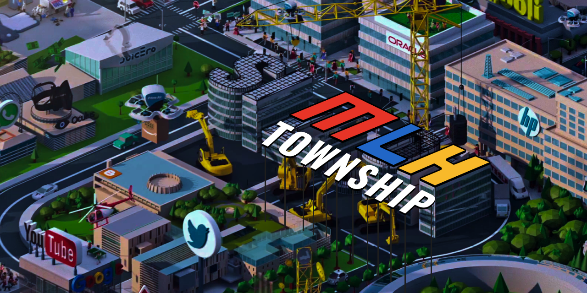

# MLH Township

<h3 align="center"> An fun way to interact and have discussions with other fellows on the web. :tada:</h3>
<p align="center">
    November 20th, 2020 - <a href='https://fellowship.mlh.io/'>MLH Fellowship</a> Halfway Hackathon Project<br>
    by <a href='https://github.com/zerefwayne'>Aayush Joglekar</a>, <a href='https://github.com/pandafy'>Gagan Deep</a>, <a href='https://github.com/awalvie'>Vishesh Agrawal</a> and <a href='https://github.com/grimmmyshini'>Garima Singh</a>.
</p>

## 💁‍♂️ What is the project? | [Watch the Demo](https://youtu.be/IHN9dKON70U)
**MLH Township is a web application that harnesses the power of websockets and webRTC to provide the fellows a playgournd where they can comuunicate and hang out with each other in the game-like setting of MLH Town.**

## 🙇 Why do we need it?
MLH Township makes it extremely easy to be able to cross talk and meet with different fellows throughout the fellowship. It makes it easier than ever to start a conversation or discussion about an event or a topic.

## 💻 Our tech stack!

- [PeerJS](https://peerjs.com/)
- [SocketIO](https://socket.io/)
- [WebRTC](https://webrtc.org/)
- [React](https://reactjs.org/)
- [Node](https://nodejs.org/en/)

## 🧑‍💻 Setting up development environment

The project is divided into two directories `client`(written in React) and `server`(written in Node).
You will have to spin up individual servers for these components.

#### Spinning up Node server

1. Change current working directory to `server`

```
cd server
```

2. Install dependencies

```
npm install
```

3. Run server

```
npm start
```

After following above steps, the backend server should be up and running at [http://localhost:5000](http://localhost:5000).

**Note**: Browsing [http://localhost:5000](http://localhost:5000) will render a playing displaying
`Cannot GET /`. You need not get alarmed by this. It is the expected behavior.

#### Spinning up React server

1. Change current working directory to `client`

```
cd client

```

2. Install dependencies

```
npm install
```

3. Run server

```
npm run
```

After following above steps, you can browse the client on [http://localhost:3000](http://localhost:3000).
